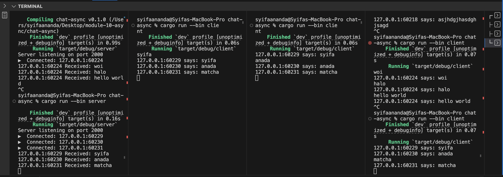

## Original code, and how it run

In this experiment I ran one server and three clients all connected to `ws://127.0.0.1:2000`. Whenever any client types a message, the server immediately rebroadcasts it to every connected client. In the screenshot we can see each client printing lines like “127.0.0.1:60229 says: syifa”, “127.0.0.1:60230 says: anada”, and “127.0.0.1:60231 says: matcha” in the order they were sent. The server console also logs each reception, for example “127.0.0.1:60229 Received: syifa”. To reproduce this, open one terminal and run `cargo run --bin server`, then open three more and run `cargo run --bin client` in each, anything we type in one client will instantly appear in the others.

## Modifying port

All we need to do is change the port number in two places: in the server’s `TcpListener::bind("127.0.0.1:2000")` call, and in the client’s `Uri::from_static("ws://127.0.0.1:2000")` string—just swap “2000” for “8080” in both. Everything else stays exactly the same, because we’re still using the same `ws://` WebSocket protocol, we’re only telling both sides to talk over port 8080 instead of 2000. Once we make those two edits, restart the server first, then the clients, and we will see messages flowing just like before, but now on port 8080.

